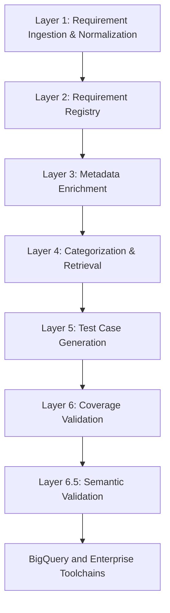

# Automating Test Case Generation with AI

An AI-powered system that automatically converts healthcare software requirements into compliant, traceable test cases integrated with enterprise toolchains.

---

## Problem Statement

Healthcare software development is constrained by:

- Complex regulatory requirements (FDA, IEC 62304, ISO 13485, ISO 27001, GDPR, HIPAA).
- Requirements stored in heterogeneous formats (PDF, Word, XML, HTML, JSON).
- Manual test case creation that is time-consuming and error-prone.
- Maintaining compliance traceability across enterprise toolchains.

This results in slow product cycles, high QA costs, and compliance risks.

---

## Objective

To build an AI-powered system that:

- Ingests and normalizes requirements from multiple formats.
- Generates complete and traceable test cases automatically.
- Ensures compliance and audit readiness.
- Integrates with enterprise ALM toolchains such as Jira, Polarion, and Azure DevOps.
- Reduces manual QA effort while ensuring scalability and compliance.

---

## Architecture Overview

## Pipeline Details

### Layer 1 – Requirement Ingestion & Normalization
- Parse multi-format documents (PDF, Word, XML, HTML, JSON).
- Remove noise (headers, footers, boilerplate).
- Segment text into atomic, testable sentences.
- Identify requirement candidates using domain heuristics.
- Deduplicate and normalize.
- Assign metadata (UUID, source file, timestamp).
- Export to BigQuery and JSON.

### Layer 2 – Requirement Registry
- Convert text into structured JSON with LLMs.
- Fields include category, title, severity, regulation, actors, data types, and acceptance criteria.
- Deduplicate and validate structured data.
- Preserve traceability metadata.
- Store in BigQuery.

### Layer 3 – Metadata Enrichment
- Detect and auto-tag regulations (HIPAA, GDPR, ISO, FDA).
- Extract verbs (actions) relevant for testing (e.g., encrypt, audit).
- Normalize actors and data types.
- Store enriched metadata for transparency.

### Layer 4 – Categorization & Retrieval
- Generate embeddings using Vertex AI.
- Categorize requirements into Functional, Security, Performance, Usability, Compliance, and Reliability.
- Store structured data with embeddings in BigQuery.
- Enable hybrid SQL and semantic search.

### Layer 5 – Test Case Generation
- Generate Positive, Negative, and Edge test cases per requirement.
- Normalize schema for test cases.
- Export to BigQuery (`test_cases` table).

### Layer 6 – Coverage Validation
- Ensure every requirement maps to at least one Positive, Negative, or Edge test case.
- Generate requirement-to-test case traceability matrix.
- Enforce schema and ID format rules.
- Store in BigQuery (`traceability_matrix`).

### Layer 6.5 – Semantic Validation
- Validate semantic alignment between requirements and test cases using LLMs.
- Return structured JSON verdict (match, confidence, reason).
- Store results in BigQuery (`semantic_validation`).

---

## Technology Stack
- **AI/ML**: Google Gemini, Vertex AI (LLMs, embeddings, prompt engineering)
- **Data**: BigQuery (analytics and storage)
- **NLP**: spaCy (verb/action extraction, entity normalization)
- **Backend**: Python (FastAPI, asyncio for parallel LLM calls)
- **Integration**: APIs for Jira, Polarion, Azure DevOps
- **Visualization**: Streamlit, Pandas, Matplotlib

---

## Benefits
- Reduction of manual QA effort by more than 70%.
- Full compliance with healthcare regulations and standards.
- Requirement-to-test traceability for audits.
- Semantic validation ensures test cases match requirement intent.
- Integration with enterprise toolchains to support real-world workflows.
